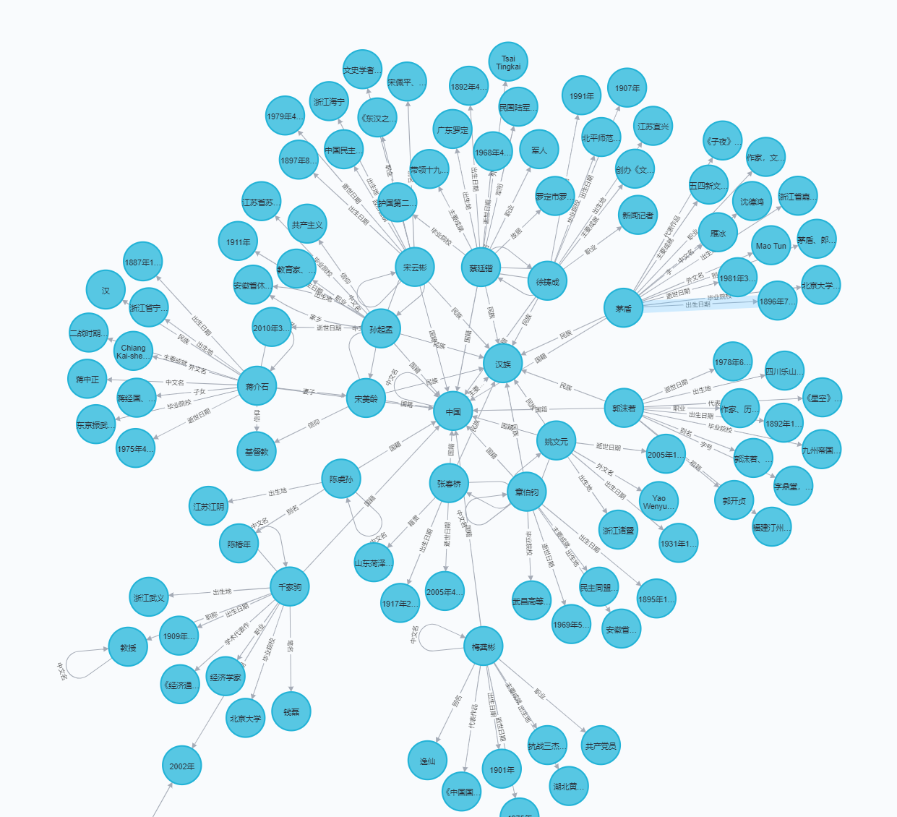

### 特别感谢原项目作者：[链接]https://github.com/lixiang0/WEB_KG

# 开源web知识图谱项目

- 爬取百度百科中文页面
- 解析三元组和网页内容
- 构建中文知识图谱


前言：本项目是在Windows上面部署
需要安装MongoDB并且配置为win服务，参考[链接]https://www.cnblogs.com/billyzh/p/5913687.html


安装Neo4j社区版，参考[链接]https://www.cnblogs.com/ljhdo/archive/2017/05/19/5521577.html


##### Tips

- 如果是项目问题，请提issue。
- 如果涉及到不方便公开的，请发邮件。

### 环境

- python 3.7.9
- re:url正则匹配
- scrapy:网页爬虫和网页解析
- neo4j:知识图谱图数据库,安装可以参考[链接](http://blog.rubenxiao.com/posts/install-neo4j.html)
- pip install neo4j：neo4j python驱动参考：[链接]https://github.com/neo4j/neo4j-python-driver
原作者用的是from neo4j.v1 import GraphDatabase
我用的时候总是报错，估计是版本的原因，所以换成from neo4j import GraphDatabase
- pip install pymongodb：mongodb的python支持
- mongodb数据库：安装参考[链接](https://docs.mongodb.com/manual/tutorial/install-mongodb-on-ubuntu/)


### 代码执行：

```
cd WEB_KG/baike
scrapy crawl baike
```

执行界面(按ctrl+c停止)：


### 知识图谱效果图



### mongodb存储的网页内容


### mongodb存储的三元组


### neo4j后台界面


