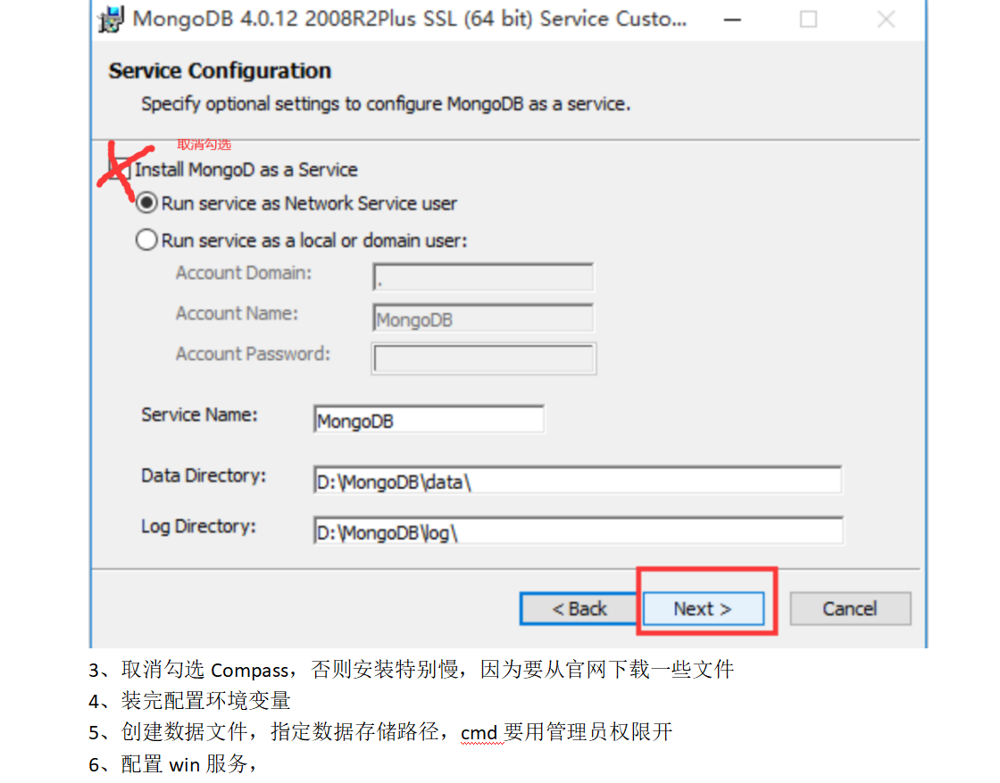
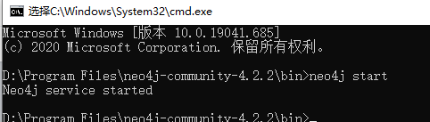
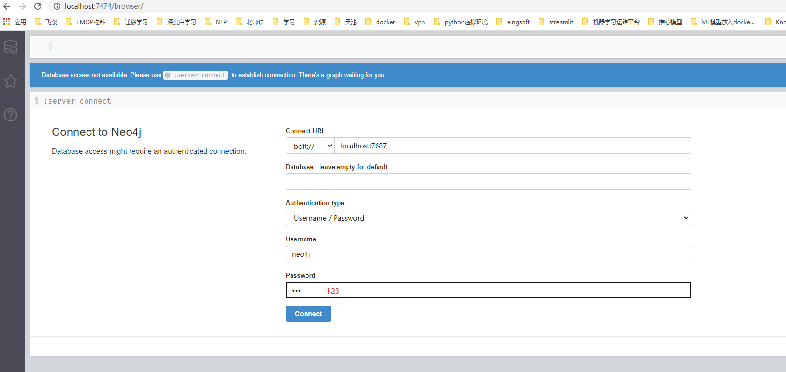
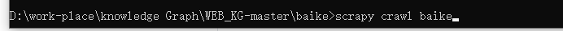
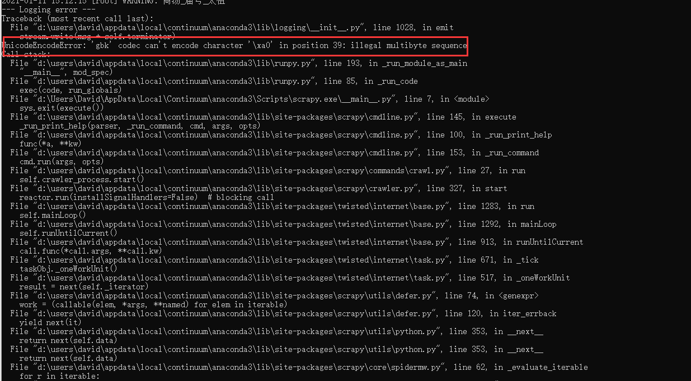

### 特别感谢原项目作者：[链接]https://github.com/lixiang0/WEB_KG

# 开源web知识图谱项目

- 爬取百度百科中文页面
- 解析三元组和网页内容
- 构建中文知识图谱


前言：本项目是在Windows上面部署

需要安装MongoDB并且配置为win服务，参考[点我吧](https://www.cnblogs.com/billyzh/p/5913687.html)
还有一些安装时小坑我也放在文档里面，参考[点我吧](https://github.com/hua7448/Spider-BK-data-and-create-KnowledgeGraph/blob/master/MongoDB%E5%AE%89%E8%A3%85%E8%B8%A9%E5%9D%91%E8%AE%B0%E5%BD%95.docx)



安装Neo4j社区版，参考[点我吧](https://www.cnblogs.com/ljhdo/archive/2017/05/19/5521577.html)

### 环境

- python 3.7.9
- re:url正则匹配
- scrapy:网页爬虫和网页解析
- neo4j:知识图谱图数据库,安装可以参考[点我吧](http://blog.rubenxiao.com/posts/install-neo4j.html)
- pip install neo4j：neo4j python驱动参考：[点我吧](https://github.com/neo4j/neo4j-python-driver)

原作者用的是from neo4j.v1 import GraphDatabase
我用的时候总是报错，估计是版本的原因，所以换成from neo4j import GraphDatabase
- pip install pymongodb：mongodb的python支持
- mongodb数据库：安装参考[点我吧](https://docs.mongodb.com/manual/tutorial/install-mongodb-on-ubuntu/)


### 代码执行：
1、启动MongoDB服务


2、启动Neo4j，账户密码和代码中保持一致即可





3、运行爬虫文件


```
scrapy crawl baike
```
4、执行界面(按ctrl+c停止)：


5、运行过程还是有一些Bug，我看了下是由于编码问题造成的，但是不影响程序继续抓取数据，后续有时间再修复




### 知识图谱效果图


